# Painel por Categoria

Tema filho do Boost para Moodle 4.5 LTS que agrupa os cursos matriculados do
aluno por categoria, com progresso por curso, identidade visual configurável
pelo painel de administração e seletor de tema claro/escuro/sistema. Quarto
de uma série de cinco projetos de portfólio voltados a um edital de
Desenvolvedor Web para um ambiente EaD baseado em Moodle.

- **Repositório:** https://github.com/shongasbarbosa/projeto-04-tema-moodle-categorias
- **Página de apresentação:** https://shongasbarbosa.github.io/projeto-04-tema-moodle-categorias/

## Objetivo

Cobrir as atribuições de um edital de Desenvolvedor Web ligadas à codificação
do front-end do Moodle (HTML5, CSS3/SCSS, Mustache), à instalação/atualização
/manutenção do Moodle via Docker, e à organização dos cursos da plataforma
por categorias — com um tema filho do Boost que não altera nenhum arquivo do
núcleo do Moodle.

## Funcionalidades

- **Painel "Meus cursos por categoria"**: agrupa os cursos matriculados do
  aluno por categoria, com barra de progresso e percentual por curso.
- **Identidade visual configurável**: cor primária, logo e uma cor por
  categoria, tudo pelo painel de administração, sem editar código.
- **Tema claro/escuro/sistema**: seletor no cabeçalho, com persistência entre
  sessões e sem flash do tema errado ao recarregar a página.
- **Acessível (WCAG AA)**: barras de progresso com `role="progressbar"` e
  `aria-*`, foco visível, cores verificadas por contraste em ambos os modos.
- **Responsivo**: grade de cursos em coluna única em telas estreitas,
  seletor de tema colapsado em um único botão abaixo de 768px.

## Prints

| Login (claro) | Login (escuro) |
| --- | --- |
| 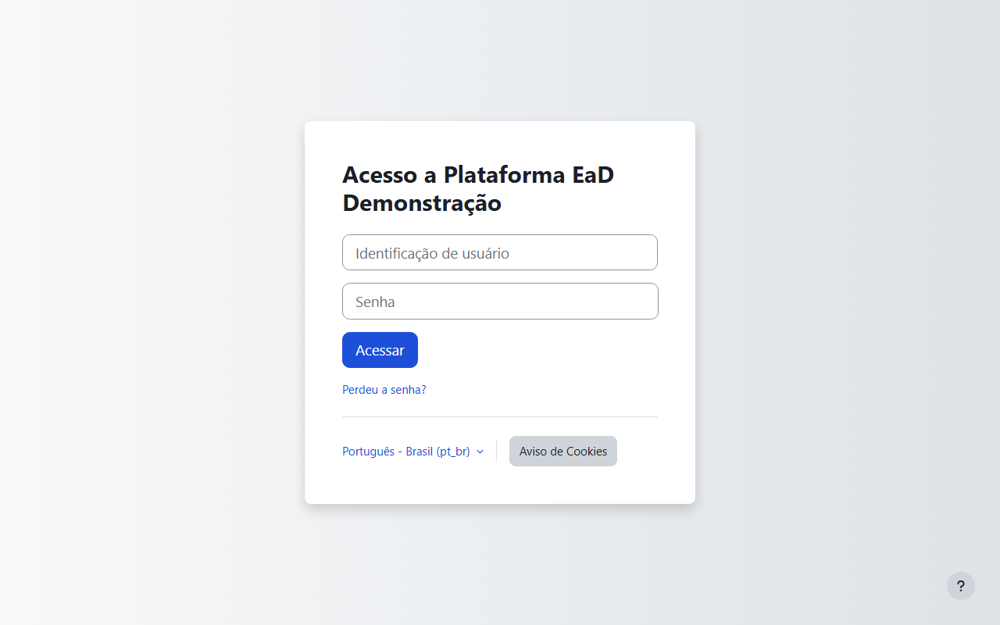 | 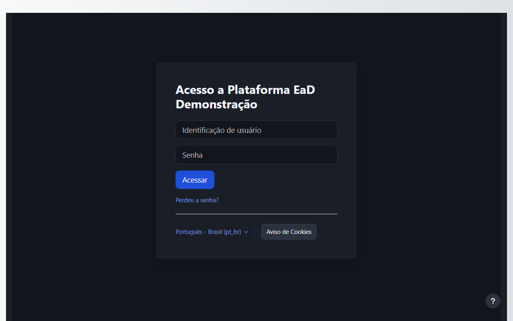 |

| Painel por categoria (claro) | Painel por categoria (escuro) |
| --- | --- |
| 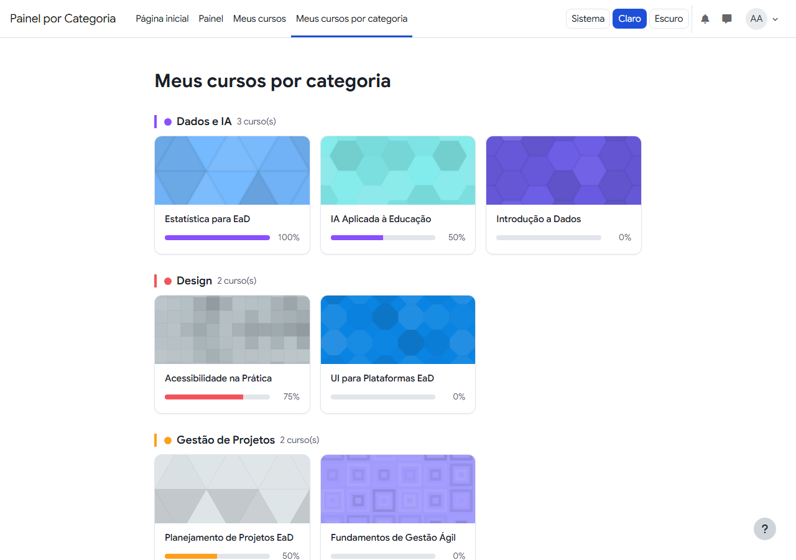 | 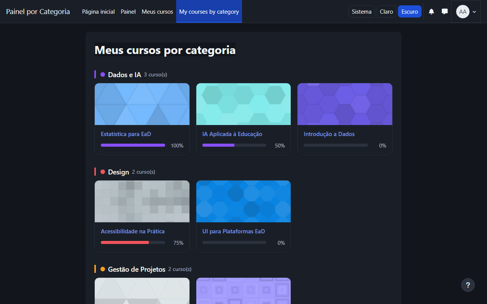 |

| Página do curso (claro) | Página do curso (escuro) |
| --- | --- |
| 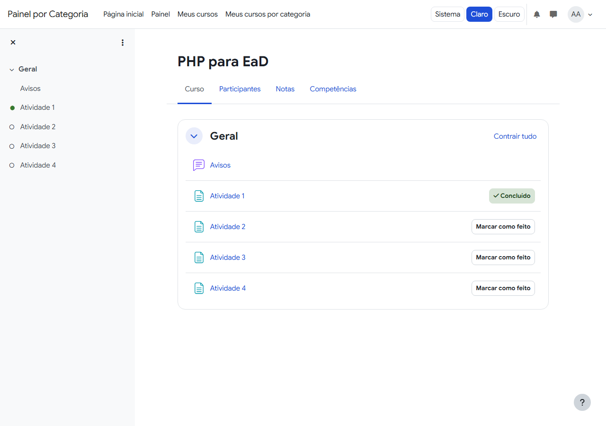 | 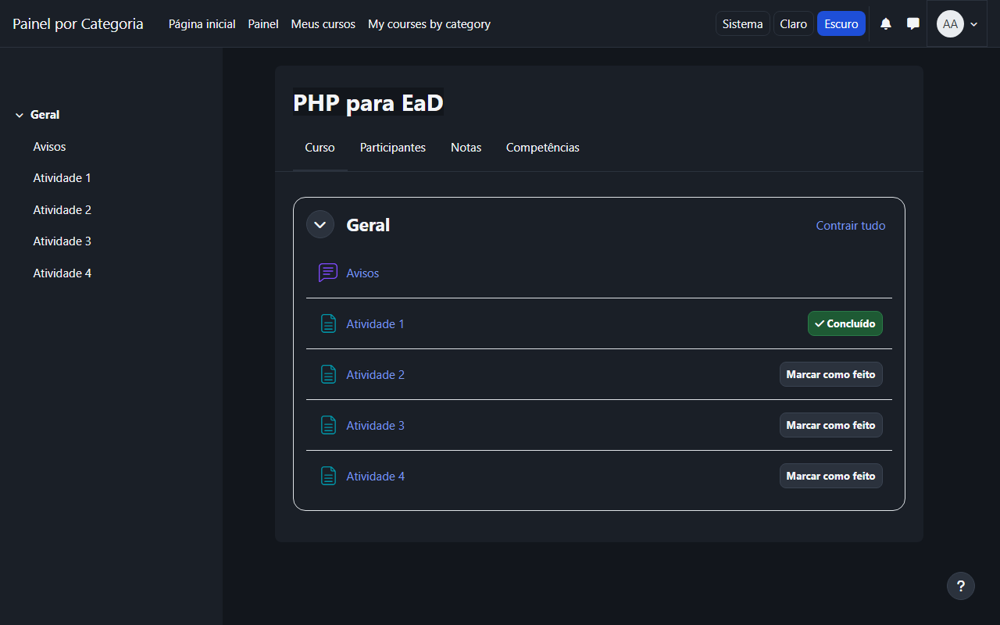 |

| Modo de edição (claro) | Modo de edição (escuro) |
| --- | --- |
| 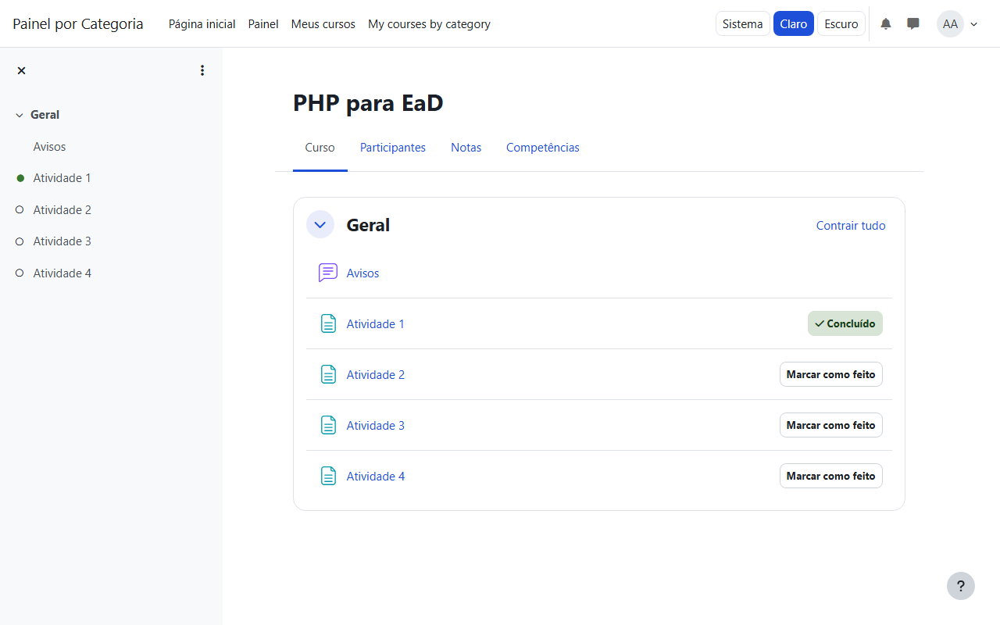 | 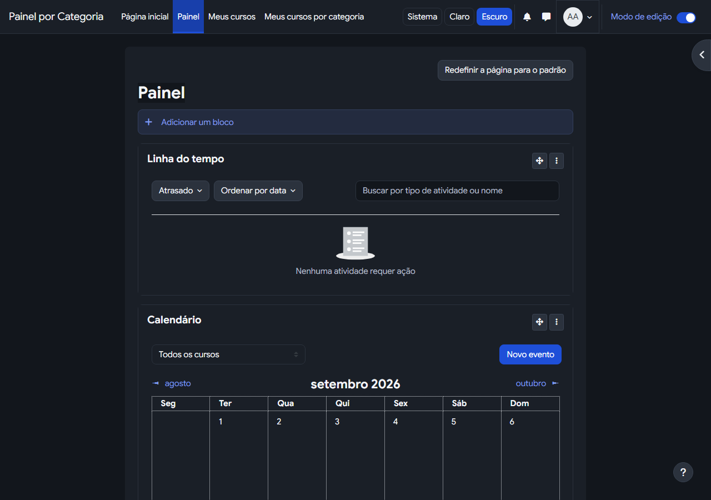 |

| Configurações do tema, admin (claro) | Configurações do tema, admin (escuro) |
| --- | --- |
| 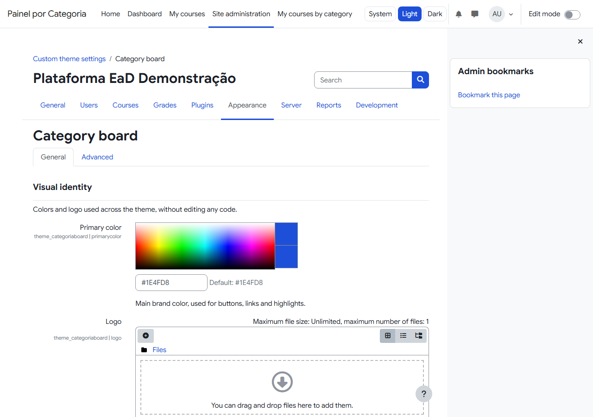 | 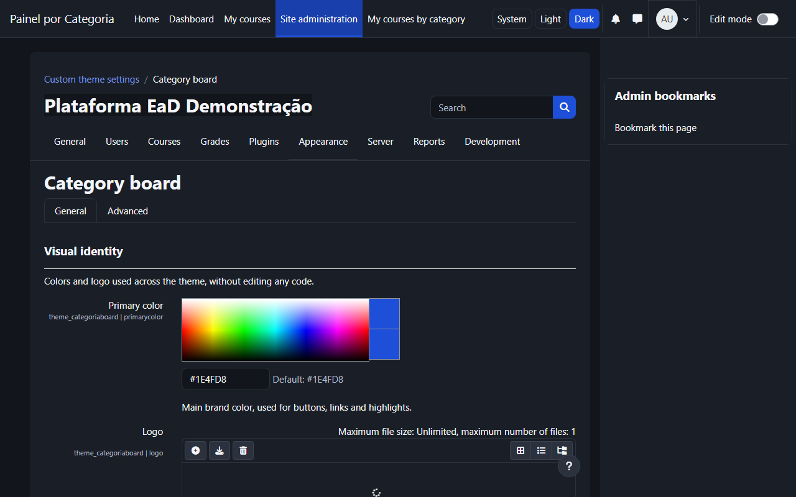 |

| Login a 360px (escuro) | Painel por categoria a 360px (escuro) |
| --- | --- |
| 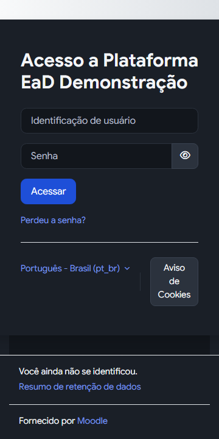 | 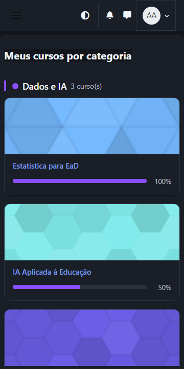 |

## Stack

**Moodle:** 4.5 LTS (`MOODLE_405_STABLE`), PHP 8.3, PostgreSQL 16, Boost
(Bootstrap 4.6.2).

**Tema:** SCSS (pre/post via `$THEME->prescsscallback`/`extrascsscallback`),
Mustache, JavaScript ES module (AMD), PHPUnit, moodle-plugin-ci.

**Infra:** Docker, moodlehq/moodle-docker, GitHub Actions, Playwright +
axe-core para verificação visual.

## Arquitetura

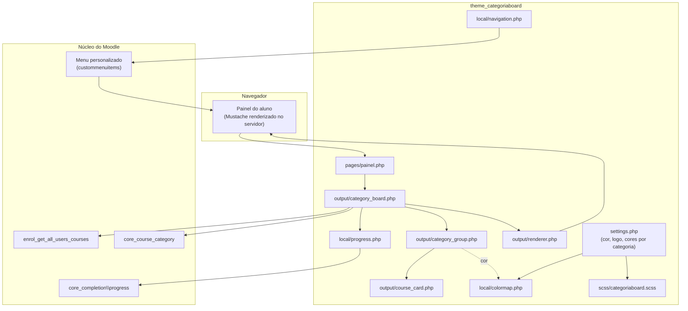

O painel é montado inteiramente no servidor, não por um bloco Vue no
navegador (ver "Decisões técnicas" para o porquê). `category_board` busca os
cursos matriculados do usuário, agrupa por categoria e calcula o progresso de
cada curso; cada grupo vira um `category_group` (categoria + `course_card[]`)
exportado para templates Mustache próprios do tema através do `renderer`. O
resultado é servido por uma página própria do tema, referenciada por um item
no menu personalizado do cabeçalho.

### Estrutura de arquivos

```
theme/categoriaboard/
├── version.php, config.php, lib.php, settings.php
├── classes/
│   ├── admin_setting_categorycolors.php   # validação da configuração de cores
│   ├── local/colormap.php, progress.php, navigation.php  # regras puras, testadas isoladamente
│   ├── output/category_board.php, category_group.php, course_card.php, renderer.php
│   └── privacy/provider.php               # null_provider (não guarda dados pessoais)
├── lang/en, lang/pt_br
├── pages/painel.php                       # a página "Meus cursos por categoria"
├── scss/categoriaboard.scss               # componentes próprios, tokens, modo escuro
├── templates/
│   ├── category_board.mustache, category_group.mustache, course_card.mustache
│   └── theme_boost/head.mustache, navbar.mustache   # overrides mínimos do Boost
├── amd/src/thememode.js, amd/build/thememode.min.js  # seletor de tema
├── fonts/LICENSE.txt                       # SIL OFL — ver "Tipografia"
└── tests/local, tests/output, tests/behat

local/categoriaboarddemo/       # plugin só de desenvolvimento — ver "Dados de demonstração"
```

## Decisões técnicas

### Painel montado no servidor, não um override de Mustache

O bloco padrão do Moodle "Visão geral dos cursos" (`block_myoverview`)
carrega os cursos via JavaScript (chamando funções externas como
`core_course_get_enrolled_courses_by_timeline_classification`); seu template
Mustache no servidor só renderiza um contêiner vazio para a aplicação Vue que
roda no navegador. Um override de template Mustache sozinho, portanto, não
tem acesso aos cursos, categorias ou progresso no momento em que a página é
montada no servidor — não haveria como agrupar por categoria nem ler o
progresso ali. Por isso o painel deste tema é montado inteiramente no
servidor, como uma página própria do tema (ver diagrama acima), sem
substituir ou desativar `block_myoverview`.

### Overrides de template: só dois, e por que esses dois

- **`templates/theme_boost/head.mustache`** — idêntico ao original, com um
  único acréscimo: um `<script>` síncrono logo na abertura de `<head>`, antes
  de `standard_head_html`, que aplica a preferência de tema salva em
  `localStorage` ao atributo `data-categoriaboard-theme` do `<html>` — evita o
  flash de tema claro antes de trocar para escuro. Esse template é incluído
  tanto pelo layout principal (`columns2`) quanto pela página de login
  (`login`), então um único override cobre as duas.
- **`templates/theme_boost/navbar.mustache`** — idêntico ao original, com os
  três botões do seletor Sistema/Claro/Escuro adicionados ao cabeçalho
  (visíveis a partir de 768px), mais uma segunda variante abaixo de 768px: um
  único botão de ícone (`aria-haspopup`, `aria-label` anunciando o modo
  atual) que abre um menu com as mesmas três opções, evitando três botões
  competindo por espaço na barra em telas pequenas. A chamada
  `require(['theme_categoriaboard/thememode'], ...)` inicializa o módulo AMD
  para ambas as variantes.

Nenhum outro template do Boost ou do núcleo é sobrescrito.

### Menu "Meus cursos por categoria"

`theme_categoriaboard_extend_navigation()` não é chamada pelo núcleo: esse
callback só é processado para plugins do tipo `local`
(`get_plugin_list_with_function('local', 'extend_navigation')`, em
`lib/navigationlib.php`) — temas não têm hook equivalente para adicionar
itens à navegação principal/drawer.

A solução usada é a única superfície de navegação que um tema Boost
realmente controla: o **menu personalizado** do núcleo
(`$CFG->custommenuitems`, Administração do site → Aparência → Configurações
avançadas de aparência), renderizado no cabeçalho por todo tema baseado em
Boost. `theme_categoriaboard\local\navigation::sync_custom_menu_item()`
adiciona ou remove a linha do painel nesse texto (identificada por um
marcador, preservando qualquer outra linha que o admin tenha colocado à
mão), chamada ao salvar a configuração "Ativar agrupamento por categoria"
e pelos scripts de instalação/seed, para o link já aparecer sem precisar
abrir e salvar a tela de configurações do tema manualmente. Coberta por
`tests/local/navigation_test.php`.

**Alternativas avaliadas:** redirecionar `/my` inteiro para o painel foi
descartado porque afetaria também professores e admin (o painel é uma visão
de aluno matriculado em várias categorias) e porque `/my` é montado por
código do núcleo, sem um ponto de override de tema tão direto quanto o menu
personalizado. Mostrar o painel *dentro* de `/my` exigiria um bloco próprio,
fora do escopo deste projeto (tema + plugin de seed).

### Identidade visual e modo escuro

- **SCSS com pre/post**: `theme_categoriaboard_get_pre_scss()` injeta
  `$primary` (da configuração do admin) e os tokens de raio/sombra/superfície
  antes do SCSS do Bootstrap/Boost; `theme_categoriaboard_get_extra_scss()`
  acrescenta `scss/categoriaboard.scss` (componentes do painel, login,
  cabeçalho, seletor de tema) depois.
- **Cor por categoria**: configurada como texto estruturado (`id|#rrggbb`,
  uma linha por categoria) em **Aparência → Painel por Categoria**, validada
  por `theme_categoriaboard\local\colormap` (testada em
  `tests/local/colormap_test.php`) e aplicada via CSS custom property
  (`--categoriaboard-category-color`) em cada grupo do painel.
- **Tema claro/escuro**: `[data-categoriaboard-theme="dark"]` redefine
  variáveis de superfície/texto/borda e reaplica essas variáveis sobre cada
  componente do Bootstrap 4.6.2/Boost usado neste ambiente (`.card`,
  `.list-group-item`, `.dropdown-menu`, `.modal-content`, `.form-control`,
  `.table`, `.alert-*`, `.btn-*`, `.navbar`, os drawers, diálogos YUI do
  seletor de arquivos, a barra e os menus do TinyMCE, o rodapé e a página de
  login). Bootstrap 4 não expõe variáveis CSS para seu sistema de cores (as
  variáveis Sass são resolvidas em tempo de compilação), então não existe um
  único interruptor que escureça tudo de uma vez — cada componente é
  re-temizado explicitamente em `scss/categoriaboard.scss`, em vez de
  compilar e entregar duas folhas de estilo inteiras (uma por modo) e trocar
  entre elas. Ver "Modo escuro e verificação visual" para como isso é
  validado.

### Tipografia (Google Sans)

O SCSS declara `@font-face` para os pesos 400/500/600/700 usando o
placeholder nativo do Moodle `[[font:theme_categoriaboard|arquivo.woff2]]`
(resolvido automaticamente para a URL correta pelo pós-processamento de CSS
do Moodle). Os arquivos `.woff2` (subset latin, extraídos do pacote
[`@fontsource/google-sans`](https://www.npmjs.com/package/@fontsource/google-sans),
SIL OFL 1.1) já estão versionados em `theme/categoriaboard/fonts/`, junto
com `fonts/LICENSE.txt`. Se algum arquivo for removido, o `font-family` cai
no fallback do próprio `@font-face`
(`-apple-system, BlinkMacSystemFont, 'Segoe UI', Roboto, sans-serif`), então
o tema continua funcionando, só sem a fonte específica.

### Configurações do admin (`settings.php`)

Duas abas, em **Aparência → Painel por Categoria**:

| Aba | Configuração | Efeito |
| --- | --- | --- |
| Geral | Cor primária (seletor de cor) | `$primary` no SCSS |
| Geral | Logo | Login e cabeçalho |
| Geral | Ativar agrupamento por categoria | Liga/desliga o link e a página do painel |
| Geral | Cores por categoria | `id\|#rrggbb` por linha, validado |
| Avançado | SCSS bruto | Regras extras, mesmo padrão do Boost |

### Identidade e textos do site

Nome completo, nome curto (exibido no cabeçalho) e o título da página de
login **não são configurações do tema** — são, respectivamente, campos da
página do curso principal (id 1) e uma string do núcleo (`core/loginsite`),
então não têm um `admin_setting` correspondente em `theme_categoriaboard`.
Ambos são aplicados por `local/categoriaboarddemo/cli/configure-site.php`:

- Nome completo/curto: `UPDATE {course} SET fullname=…, shortname=… WHERE id = 1`.
- Título do login: um arquivo em `$CFG->dataroot/lang/<idioma>_local/moodle.php`
  com `$string['loginsite'] = '…'`, em `pt_br_local` e `en_local` — o mesmo
  mecanismo que `admin/tool/customlang` usa para customizar qualquer string
  do núcleo sem tocar em nenhum arquivo do Moodle e sem substituir o pacote
  de idioma instalado (`dataroot/lang/<idioma>/`, mesclado por baixo pelo
  gerenciador de strings).

O botão "Acessar como visitante" também é desativado ali
(`set_config('guestloginbutton', 0)`), já que o projeto não usa acesso de
visitante, e `forcelogin` é ativado (`set_config('forcelogin', 1)`) para que
qualquer acesso anônimo — incluindo a raiz do site após logout — redirecione
para `/login/index.php` em vez de listar os cursos publicamente.

### Fuso horário e idioma dos dados de demonstração

O site e os usuários de demonstração usam `America/Sao_Paulo`
(`set_config('timezone', ...)` e `set_config('forcetimezone', ...)` em
`configure-site.php`, mais o campo `timezone` de cada usuário criado pelo
seed). O aluno e o professor de demonstração são criados com `lang = pt_br`
antes de qualquer matrícula, e os cursos de demonstração não enviam mensagem
de boas-vindas (`sendcoursewelcomemessage = 0`), para não gerar notificações
de teste desnecessárias.

### Acessibilidade (WCAG AA)

- `role="progressbar"` com `aria-valuemin`/`aria-valuemax`/`aria-valuenow`
  e `aria-label` descritivo em cada barra de progresso.
- Cards com foco visível (`:focus-visible` com contorno na cor da categoria)
  e área de clique única (`<a>` envolvendo todo o card).
- Botões do seletor de tema com `aria-pressed` refletindo o estado atual.
- Cores padrão (`#1E4FD8` sobre branco/`#12161C`) verificadas para contraste
  AA de texto; cores de categoria customizadas pelo admin não são
  verificadas automaticamente — é responsabilidade de quem configura manter
  contraste adequado, assim como no seletor de cor nativo do Boost.
- `<section aria-labelledby>` no painel, listas semânticas (`role="list"`)
  para os cards.

### Estados vazios e responsividade

- Sem nenhum curso: mensagem de estado vazio no lugar do painel.
- Categoria sem cursos visíveis: mensagem por categoria.
- Cards em grade responsiva (`repeat(auto-fill, minmax(220px, 1fr))`), sem
  media queries manuais.

## Ambiente Docker e desempenho

### Por que moodlehq/moodle-docker

Ferramenta oficial mantida pela Moodle HQ, com imagens `moodle-php-apache`
atualizadas para PHP 8.3/Moodle 4.5, suporte a PostgreSQL/MariaDB, PHPUnit e
Behat prontos para uso, e um mecanismo documentado de customização local
(`local.yml`) — evita reinventar um `docker-compose.yml` do zero e mantém o
ambiente alinhado com o que o próprio projeto Moodle usa em CI.

### Código do Moodle fora do bind mount do Windows

No Docker Desktop para Windows, um bind mount de um checkout completo do
Moodle (~29 mil arquivos) passa por uma camada de compartilhamento de
arquivos entre o Windows e a VM Linux (WSL2) ordens de grandeza mais lenta
que I/O nativo — cada `require`/`include` do PHP (e o Moodle faz milhares
por request) paga esse custo.

O código do Moodle vive inteiramente dentro de um **volume nomeado do
Docker** (`categoriaboard_moodlecore`), populado por um `git clone` que roda
*dentro* de um container (`scripts/lib/core-volume.sh`), nunca através do
bind mount do Windows. `docker/local.yml` substitui o mount padrão do
`moodle-docker` para `/var/www/html` (um bind mount, definido no `base.yml`
deles) por esse volume nomeado — o Compose mescla listas de `volumes` por
*target*, então declarar o mesmo destino substitui a entrada original em vez
de duplicá-la:

```yaml
services:
  webserver:
    volumes:
      - "moodlecore:/var/www/html"                                          # substitui o bind mount original
      - "${CATEGORIAB_THEME_DIR}:/var/www/html/theme/categoriaboard"        # tema (inalterado)
      - "${CATEGORIAB_LOCAL_DIR}:/var/www/html/local/categoriaboarddemo"    # plugin de seed (inalterado)

volumes:
  moodlecore:
    external: true
    name: "${CATEGORIAB_CORE_VOLUME}"
```

O tema e o plugin de seed continuam sendo bind mounts — dois conjuntos
pequenos de arquivos editados no repositório, não 29 mil arquivos do Moodle
— já que o custo do bind mount no Windows é por arquivo tocado por request,
não fixo.

`$MOODLE_DOCKER_WWWROOT` ainda precisa apontar para um diretório existente
no host, porque o próprio script `bin/moodle-docker-compose` do
`moodle-docker` valida isso antes de montar qualquer coisa — mas seu
conteúdo não importa mais, já que `local.yml` sobrescreve o mount de
`/var/www/html`.

`scripts/reset-core.ps1` apaga e reclona esse volume do zero (para trocar
de branch do Moodle, por exemplo); `scripts/destroy.ps1`/`reset.ps1`
**não** tocam nele, porque ele é declarado `external: true`.

### Ambiente de demonstração como produção

O `config.docker-template.php` original do `moodle-docker` é um ambiente de
*desenvolvimento* Moodle: `$CFG->debug = E_ALL` (`DEBUG_DEVELOPER`),
`debugdisplay = 1` (rodapé de depuração em toda página) e `perfdebug = 15`
(coleta métricas de desempenho em cada request). O `docker/config.php.template`
deste projeto (copiado para dentro do volume por `core-volume.sh`) parte do
mesmo arquivo mas com esses três valores zerados.

`themedesignermode`, `cachejs`, `cachetemplates` e `langstringcache`
**não são definidos** no arquivo: por padrão (ausentes do `config.php`) o
Moodle já usa os valores de produção — cache de SCSS/Mustache/strings
ativado.

**Para ligar o modo desenvolvedor temporariamente** (ao editar SCSS/Mustache
e querer ver o resultado sem esperar o cache expirar), edite o `config.php`
dentro do volume — ele não é bind-mounted, então a edição precisa ser feita
dentro do container:

```powershell
docker exec -it categoriaboard-webserver-1 bash
# dentro do container:
sed -i \
  -e "s/\$CFG->debug = 0;/\$CFG->debug = 32767;/" \
  -e "s/\$CFG->debugdisplay = 0;/\$CFG->debugdisplay = 1;/" \
  -e "s/\$CFG->perfdebug = 0;/\$CFG->perfdebug = 15;/" \
  /var/www/html/config.php
echo '$CFG->themedesignermode = true; $CFG->cachejs = false; $CFG->cachetemplates = false;' >> /var/www/html/config.php
php admin/cli/purge_caches.php
```

Para voltar ao modo de demonstração, rode `scripts/reset-core.ps1` (reclona
o volume com o `config.php` de produção) ou desfaça as mesmas edições à mão.

### Serviços removidos (selenium, exttests)

O `base.yml` do `moodle-docker` sempre declara os serviços `selenium`
(usado pelo Behat) e `exttests` (endpoints HTTP de teste para envio de
arquivos), independentemente de serem usados localmente. `scripts/lib/up.sh`
sobe os containers passando a lista explícita de serviços
(`docker compose up -d webserver db mailpit`) em vez de deixar o Compose
subir tudo que os arquivos declaram — evita baixar/rodar a imagem do
Selenium localmente, sem afetar o CI, que roda o Behat separadamente (ver
"CI").

### Como os plugins chegam ao Moodle

`moodle-docker` não tem uma variável de ambiente para "pasta de plugins
extra" — o próprio README dele documenta o mecanismo para isso: `local.yml`,
carregado automaticamente por `bin/moodle-docker-compose` se existir. Ver
"Código do Moodle fora do bind mount do Windows" acima para o
`docker/local.yml` completo.

`scripts/lib/common.sh` copia esse arquivo para `.moodle-docker/local.yml`
(regenerado a cada execução, por isso está no `.gitignore`) antes de chamar
`bin/moodle-docker-compose`. Nenhum symlink é necessário — importante no
Windows, onde criar symlinks exige privilégio de administrador ou modo
desenvolvedor.

> **Nota sobre Git Bash/MSYS no Windows**: os scripts que chamam `docker run`
> diretamente (não através do `bin/moodle-docker-compose`) precisam de
> `MSYS_NO_PATHCONV=1`. Sem essa variável, o Git Bash reescreve qualquer
> argumento de linha de comando parecido com um caminho POSIX — incluindo
> caminhos *dentro* do container, como `/var/www/html` — antes de chamar
> `docker.exe`, corrompendo o mount.

### Banco de dados: PostgreSQL

PostgreSQL 16 (`MOODLE_DOCKER_DB=pgsql`), a opção recomendada pela própria
documentação do Moodle para instalações novas. A porta do banco não é
exposta ao host por padrão (só o container `webserver` acessa `db:5432`),
então não há conflito com um Postgres/MySQL nativo na máquina.

### Scripts (`/scripts`)

Todos em PowerShell (`scripts/*.ps1`), chamando internamente a implementação
real em Bash (`scripts/lib/*.sh`, a mesma linguagem em que o próprio
`moodle-docker` é escrito) — evita duplicar a lógica de composição das
flags do Docker Compose em duas linguagens. Também disponíveis como scripts
`npm run <nome>` (ver `package.json`).

| PowerShell | npm | O que faz |
| --- | --- | --- |
| `scripts/up.ps1` | `npm run up` | Baixa moodle-docker/Moodle na primeira vez, sobe os containers, espera o banco |
| `scripts/install.ps1` | `npm run install:moodle` | Instala o Moodle (CLI, não interativo), idioma pt_br, ativa o tema |
| `scripts/install-ci-tools.ps1` | `npm run install:ci-tools` | Instala phpcs (padrão moodle) e inicializa o ambiente PHPUnit |
| `scripts/seed.ps1` | `npm run seed` | Roda o seed idempotente de dados de demonstração |
| `scripts/check.ps1` | `npm run check` | php -l, phpcs, PHPUnit, purge de caches |
| `scripts/down.ps1` | `npm run down` | Para os containers, mantendo os dados |
| `scripts/reset.ps1` | `npm run reset` | Destrói containers + volumes de dados (mantém o volume do Moodle) e reinstala do zero |
| `scripts/destroy.ps1` | `npm run destroy` | Só destrói containers + volumes de dados |
| `scripts/reset-core.ps1` | — | Apaga e reclona do zero o volume com o código do Moodle |

### Resultado

Tempo de instalação/setup (`categoriaboard_moodlecore` como volume nomeado,
sem bind mount do checkout completo):

| Etapa | Tempo |
| --- | --- |
| `admin/cli/install_database.php` | ~3m40s |
| `admin/tool/phpunit/cli/init.php` | ~3m35s |
| `phpunit` (29 testes) | ~8s |
| `phpcs` (tema + plugin de seed) | ~1,1s |
| Seed de demonstração | ~10s |

Tempo de resposta por página (cache aquecido, `curl -w '%{time_total}'`, sem
incluir o tempo de rede):

| Página | Tempo |
| --- | --- |
| Login (GET, deslogado) | 0,31s |
| Página inicial `/my/` (autenticado) | 0,61s |
| Painel por categoria (autenticado) | 0,47s |
| Curso (autenticado) | 0,56s |
| Atividade (autenticado) | 0,42s |
| CSS do tema (`theme/styles.php`, cacheado) | 0,0005s |

Consumo de memória (`docker stats`, ambiente aquecido):

| Container | Memória |
| --- | --- |
| `categoriaboard-webserver-1` | ~186 MB |
| `categoriaboard-db-1` | ~110 MB |
| `categoriaboard-mailpit-1` | ~19 MB |
| **Total** | **~315 MB** |

## Modo escuro e verificação visual

`scripts/visual-check/run.mjs` (Playwright + `@axe-core/playwright`,
`npm run visual-check`) abre um conjunto de páginas e interações do tema —
login, painel por categoria, página do curso com abas, `/my/` em modo de
edição, gaveta de mensagens, notificações, perfil, seletor de arquivos,
formulário de edição de atividade com TinyMCE, seletor de data e o modal de
confirmação de exclusão — em modo claro e escuro, em 1280px e 360px, logando
como aluno ou admin conforme a página. O modal de exclusão é aberto apenas
para o print e nunca confirmado, então nenhuma atividade de demonstração é
apagada.

Para cada combinação, o script:

1. Tira um screenshot (`.visual/*.png`, git-ignorado).
2. Roda o axe-core com a regra `color-contrast`, salvando o relatório
   completo em `.visual/summary.json`.
3. No modo escuro, também varre o DOM em busca de **blocos claros** —
   elementos visíveis maiores que 40×20px cujo `background-color` computado
   tem luminância relativa (fórmula WCAG) acima de 0,6, ignorando imagens,
   avatares/iniciais, badges e o iframe do TinyMCE (a área editável é uma
   janela separada, com sua própria folha de estilo, que continua clara de
   propósito — ver abaixo). O axe não detecta esse tipo de problema porque
   um bloco claro com texto escuro sobre ele pode passar individualmente no
   teste de contraste, mesmo destoando visivelmente do restante da página.

Ambas as verificações fecham em zero nas 96 combinações de página × modo ×
largura cobertas.

**Área editável do TinyMCE deixada clara intencionalmente:** o conteúdo
dentro do iframe do editor é um preview WYSIWYG do HTML que será salvo, e
esse mesmo HTML é depois renderizado em páginas normais (claras) do site —
escurecer só a preview criaria uma inconsistência entre o que o autor vê
editando e o que é publicado. Só a barra de ferramentas e os menus ao redor
do iframe são re-temizados.

**Abordagem escolhida e por quê:** o tema redefine cada componente do
Bootstrap 4.6.2/Boost explicitamente sob `[data-categoriaboard-theme='dark']`
(ver `categoriaboard.scss`), em vez de redefinir as variáveis Sass do
Bootstrap num bloco isolado por atributo `data-theme` — Bootstrap 4 resolve
essas variáveis em tempo de compilação, então uma única folha de estilo
compilada não pode ter dois conjuntos de cores escolhidos em tempo de
execução por um seletor CSS. A alternativa seria compilar e entregar ao
navegador duas folhas de estilo inteiras e trocar entre elas, fora do escopo
deste tema filho.

## Dados de demonstração

`local/categoriaboarddemo` é um plugin **só de desenvolvimento** (nunca deve
ir para produção) com um script CLI idempotente (`cli/seed.php`, rodado por
`scripts/seed.ps1`) que usa exclusivamente APIs oficiais do Moodle
(`core_course_category::create`, `create_course`, `add_moduleinfo`,
`enrol_get_plugin('manual')`, `completion_info`):

- **5 categorias**, cada uma com uma cor diferente, já escritas
  automaticamente na configuração "Cores por categoria" do tema:
  Programação (`#1E4FD8`), Design (`#F2545B`), Marketing Digital
  (`#00A676`), Dados e IA (`#8A4FFF`), Gestão de Projetos (`#FF9F1C`).
- **12 cursos** distribuídos entre as categorias (3+2+2+3+2), cada um com
  conclusão de atividades habilitada e 4 atividades (`mod_page`) com
  conclusão manual.
- **1 aluno demo** (`aluno.demo`) matriculado em todos os 12 cursos, com
  progresso variado por design: o 1º curso de cada categoria fica em 0%, o
  2º em 50% (2 de 4 atividades concluídas) e o 3º (quando existe) em 100%.
- **1 professor** (`professor.demo`), matriculado como `editingteacher` em
  todos os cursos.
- **admin**, já criado na instalação.

Rodar `scripts/seed.ps1` de novo é seguro: cada etapa verifica se a
categoria/curso/usuário/matrícula já existe antes de criar.

## Instalação do tema a partir do `.zip`

Além de rodar via Docker (ver "Como rodar o ambiente"), o tema pode ser
instalado em qualquer Moodle 4.5 já existente:

1. Gere os pacotes a partir da raiz do repositório:

   ```bash
   cd theme && zip -r ../dist/theme_categoriaboard.zip categoriaboard -x '*/amd/build/*.map'
   cd ../local && zip -r ../dist/local_categoriaboarddemo.zip categoriaboarddemo
   ```

   (`dist/` é ignorado pelo Git — os `.zip` também ficam anexados à
   [release](https://github.com/shongasbarbosa/projeto-04-tema-moodle-categorias/releases).)

2. Em **Administração do site → Plugins → Instalar plugins**, envie
   `theme_categoriaboard.zip` (a pasta `categoriaboard` precisa estar na
   raiz do `.zip`) e, opcionalmente, `local_categoriaboarddemo.zip` para
   popular dados de demonstração.
3. Em **Aparência → Temas → Seletor de temas**, ative "Painel por
   Categoria".
4. Em **Aparência → Painel por Categoria**, configure cor primária, logo e
   cores por categoria.

## Como rodar o ambiente

Pré-requisitos: Docker Desktop, Git, PowerShell 5.1+ (ou `npm`/Node.js, se
preferir os scripts `npm run`).

```powershell
copy .env.example .env
npm run up             # ou: .\scripts\up.ps1
npm run install:moodle # só na primeira vez
npm run install:ci-tools  # só na primeira vez, antes do primeiro "npm run check"
npm run seed
```

- Moodle: http://localhost:8000
- E-mails de teste (Mailpit): http://localhost:8000/_/mail

Para parar sem perder dados: `npm run down`. Para religar depois:
`npm run up` (não precisa rodar `install` nem `seed` de novo, os dados
continuam no volume do Postgres). Para começar do zero: `npm run reset`.

### Credenciais (ambiente local)

Válidas apenas no ambiente Docker local descrito acima — não uma instância
pública. Definidas em `.env.example` / `local/categoriaboarddemo/cli/seed.php`.

| Perfil | Usuário | Senha |
| --- | --- | --- |
| Admin | `admin` | `Categoriaboard@2026` |
| Professor | `professor.demo` | `Categoriaboard@2026` |
| Aluno | `aluno.demo` | `Categoriaboard@2026` |

## Testes

### PHPUnit

- `tests/local/colormap_test.php` — parsing e validação do mapa de cores
  (pares bem formados, linhas malformadas ignoradas na leitura mas
  rejeitadas na validação, uppercase de hex, cor padrão para categoria sem
  entrada).
- `tests/local/progress_test.php` — 0% antes de concluir qualquer atividade,
  100% depois de concluir todas, `null` quando a conclusão está desligada no
  curso, formatação do rótulo de porcentagem.
- `tests/output/category_board_test.php` — agrupamento por categoria (ordem
  alfabética dos grupos), matrícula ignorada quando o usuário não está
  inscrito, cursos ocultos excluídos, cor configurada aplicada ao grupo,
  fallback para a imagem gerada do próprio Moodle quando o curso não tem
  capa, formato do `export_for_template` no estado vazio.
- `tests/local/navigation_test.php` — o link do painel é adicionado ao menu
  personalizado quando ativado, removido quando desativado, outras linhas do
  menu são preservadas, e ativar duas vezes não duplica a linha.

Rodam dentro do container Docker: `scripts/check.ps1`, ou manualmente
`bin/moodle-docker-compose exec webserver vendor/bin/phpunit theme/categoriaboard/tests`.

### Behat

Um cenário (`tests/behat/category_board.feature`): aluno matriculado em
cursos de duas categorias acessa "Meus cursos por categoria" e vê os nomes
das duas categorias e dos dois cursos na página. Rodado pelo CI (ver
abaixo); não faz parte de `scripts/check.ps1` porque o ambiente Docker local
deste projeto não sobe o serviço Selenium (ver "Serviços removidos").

## CI

`.github/workflows/ci.yml` (GitHub Actions) usa `moodle-plugin-ci` contra
`MOODLE_405_STABLE`, PHP 8.3 e PostgreSQL, cobrindo os dois plugins do
repositório (`theme/categoriaboard` e `local/categoriaboarddemo`):

- PHP Lint, Moodle Code Checker (`phpcs`, padrão moodle), Moodle PHPDoc
  Checker, Validate, Savepoints, Mustache Lint, Grunt (compila o AMD e o
  SCSS e falha se o resultado divergir do que está commitado — garante que
  `amd/build/thememode.min.js` está atualizado em relação a
  `amd/src/thememode.js`), PHPUnit e Behat (perfil Chrome headless, via o
  serviço `selenium/standalone-chrome` do próprio runner do GitHub Actions).

`local_categoriaboarddemo` passa pelas mesmas checagens estáticas
(`phplint`, `phpcs`, `phpdoc`, `validate`) que o tema, mas fica fora do
`phpunit`/`behat` do CI: ele não tem testes próprios (é um script CLI de
seed, sem lógica testável isoladamente) e depende de popular categorias e
cursos reais no banco — os testes automatizados do tema já cobrem o
comportamento do painel com dados mínimos criados por eles mesmos.

## Competências demonstradas

- Codificação de front-end para Moodle: SCSS (pre/post, tokens de design),
  Mustache (templates próprios e overrides mínimos e documentados do Boost),
  JavaScript AMD, acessibilidade WCAG AA.
- Backend Moodle: renderers, classes `output`/`local` com PHPDoc completo,
  `admin_setting` customizado, hooks de navegação, privacy provider,
  APIs de curso/categoria/matrícula/conclusão.
- Organização de cursos por categoria: modelagem do agrupamento, cor por
  categoria configurável e validada.
- Docker: ambiente oficial `moodlehq/moodle-docker`, customização via
  `local.yml` (volume nomeado para o código do Moodle, `config.php` de
  produção), scripts de automação (PowerShell + Bash) para instalação não
  interativa, seed idempotente e reset.
- Qualidade: PHPUnit (regras puras + integração com dados reais do Moodle),
  Behat, `moodle-plugin-ci`/GitHub Actions, Moodle Coding Guidelines
  (phpcs, PHPDoc), verificação visual automatizada (Playwright + axe-core)
  de contraste e de blocos claros no modo escuro.
- Git: histórico organizado em commits pequenos por área do projeto.

## Autor

**Dhyego Barbosa** — https://github.com/shongasbarbosa
